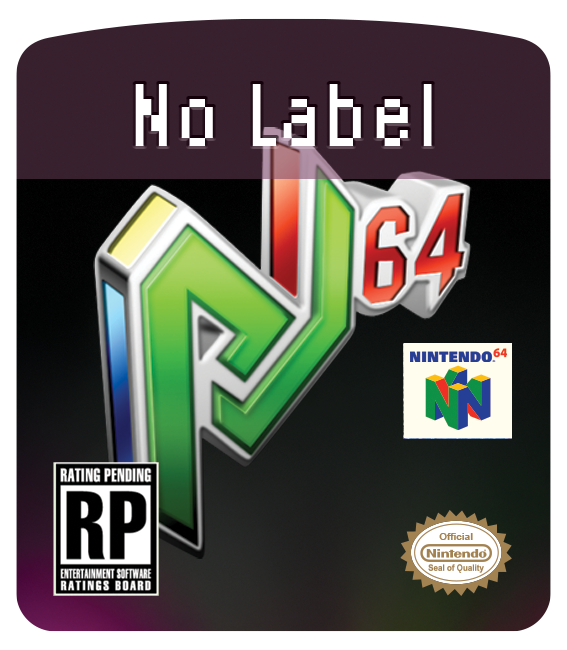
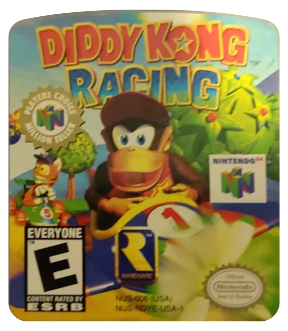
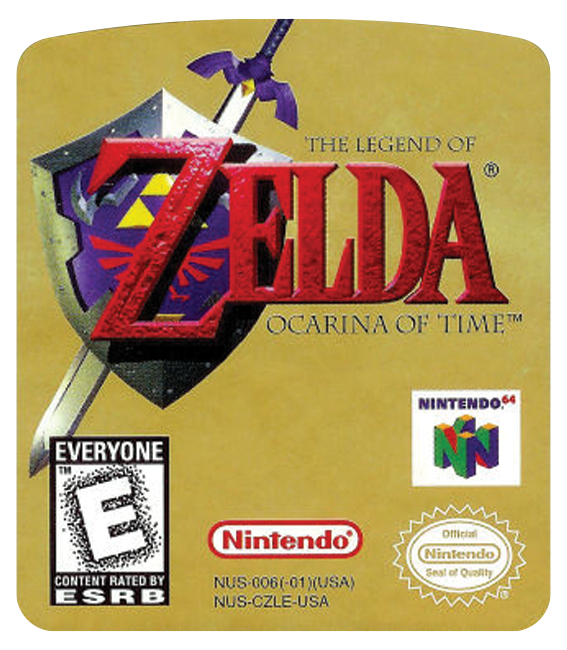
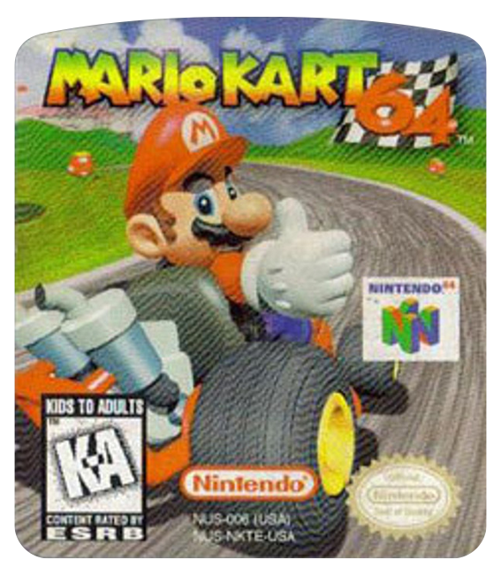
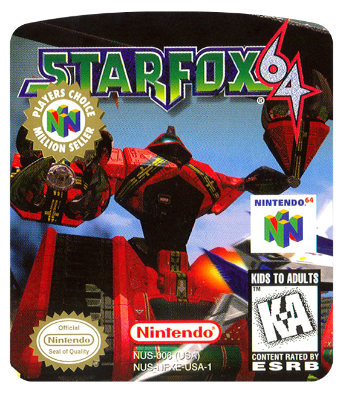
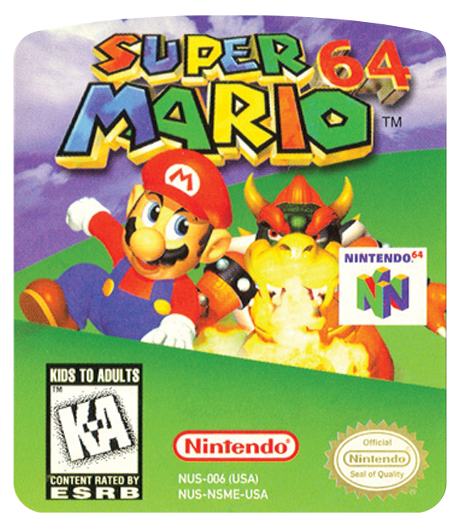
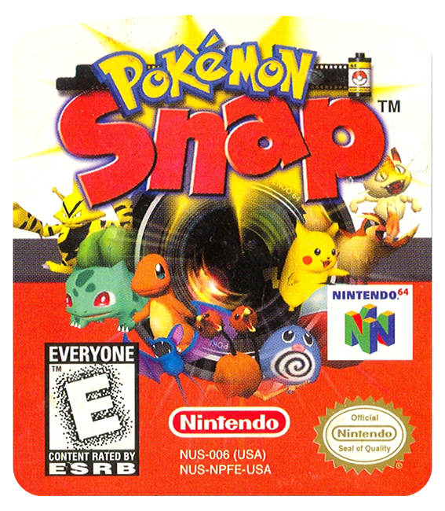

# N64 Covers

A collection of N64 covers for use with emulators. This repository serves as a centralized database of N64 game cover art specifically designed to work with the new QT-based version of Project64, [P64-QT](https://github.com/IanSkelskey/p64-qt).

## Default Game Label

## Project64 QT Redesign

I am currently working on redesigning Project64 with a QT framework frontend. The project is currently in **early development** stage and is not yet a working emulator, but rather a foundational UI framework that will eventually connect to the Project64 emulation core.

Features planned for P64-QT include:
- Cover grid view (already implemented)
- Integrated cover downloader (planned)
- Modern Qt-based interface with better scaling and theming

You can find the QT redesign project here: [P64-QT Repository](https://github.com/IanSkelskey/p64-qt)

## Cover Grid View

The new Project64 QT version features a grid view that displays game covers:

## Cover Naming Convention

For proper detection in Project64-QT, all cover images must be named according to the game's full cartridge ID code. This is the complete code found on the N64 cartridge label (e.g., NUS-NFXE-USA-1).

### Where to Find the Cartridge Code

*Screenshots showing where to find the full cartridge code on N64 cartridges will be added here.*

### Examples

Below are some examples of how to name cover files based on the cartridge code:

| Game                             | Cartridge Code | Cover Filename     |
| -------------------------------- | -------------- | ------------------ |
| Diddy Kong Racing                | NUS-NDYE-USA-1 | NUS-NDYE-USA-1.png |
| Legend of Zelda: Ocarina of Time | NUS-CZLE-USA   | NUS-CZLE-USA.png   |
| Mario Kart 64                    | NUS-NKTE-USA   | NUS-NKTE-USA.png   |
| Star Fox 64                      | NUS-NFXE-USA-1 | NUS-NFXE-USA-1.png |
| Super Mario 64                   | NUS-NSME-USA   | NUS-NSME-USA.png   |
| Pokemon Snap                     | NUS-NPFE-USA   | NUS-NPFE-USA.png   |

### Sample Label Art

Here are some sample label images for reference:

  
  
  
  
  
  

## Contributing

If you'd like to contribute covers to this repository, please read our [contribution guidelines](CONTRIBUTING.md).