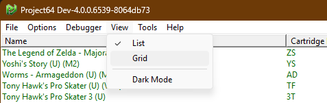
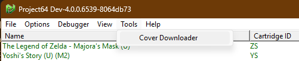
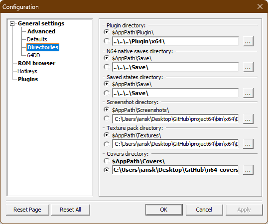
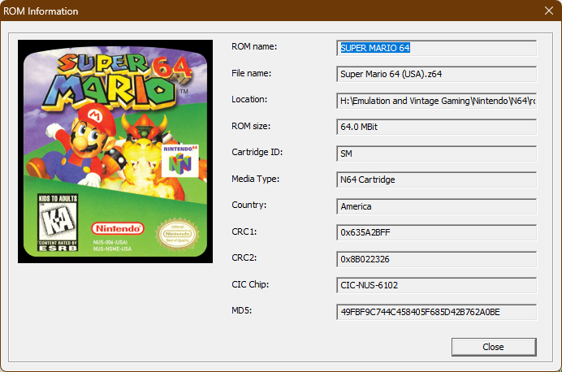
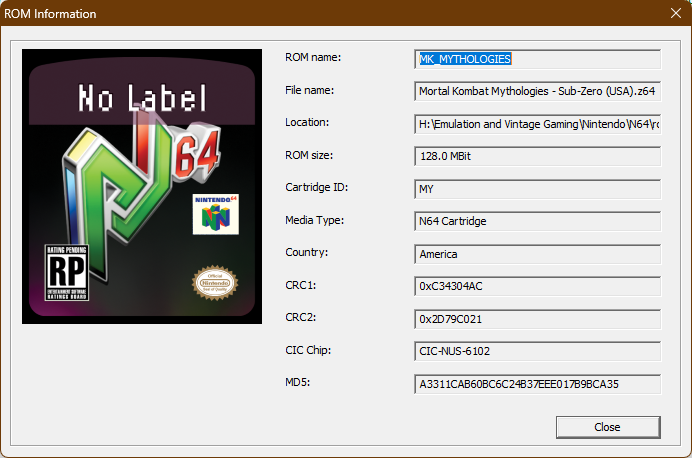

# N64 Covers

A collection of N64 covers for use with emulators. My goal is to implement a cover system in Project64 that will display art for each game in the library. This is a work in progress. While that is underway, I will be collecting and organizing covers for each game. The goal is to have a system similar to [PS2-covers](https://github.com/xlenore/ps2-covers) and PCSX2's cover downloader.

## Default Game Label

## Progress

My progress for this project is located on the cover-art branch of my fork of Project64. You can find it [here](https://github.com/IanSkelskey/project64/tree/cover-art).

## Features Added

### New Menu Items

- **View Menu:**
  - List
  - Grid
  - Dark Mode
  - All the view menu options have actual global settings that are saved and loaded on startup. They don't trigger anything yet, but they will.
- **Tools Menu:**
  - Cover Downloader

### Cover Art Directory

- Added to Options > Configuration > General > Directories

## Screenshots

### View Menu

### Tools Menu

### Directories Configuration

## Current Status

Successfully loaded and displayed cover art from this repository (by setting the cover directory in the configuration menu) in Project64 in the ROM information dialog accessed by right-clicking a ROM in the ROM browser. Currently, transparency is not supported, so the background is black.

If there is no cover art for a game, the ROM information dialog will display a default label.

